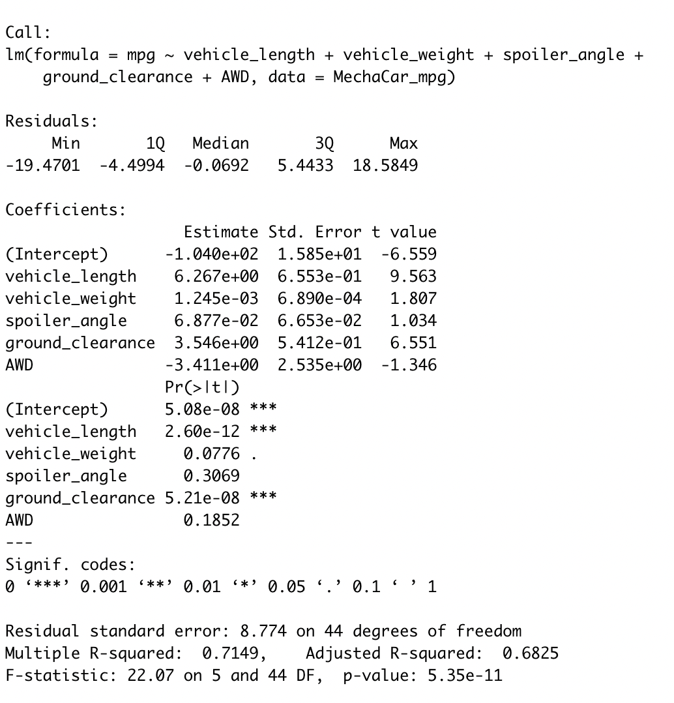
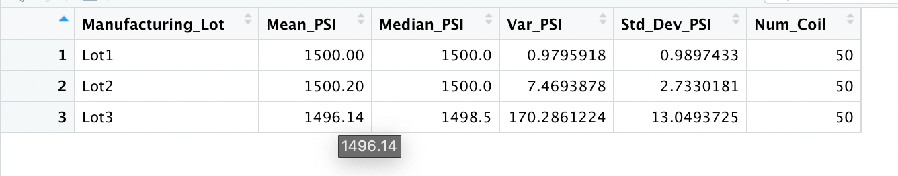
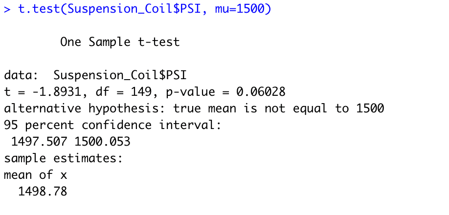
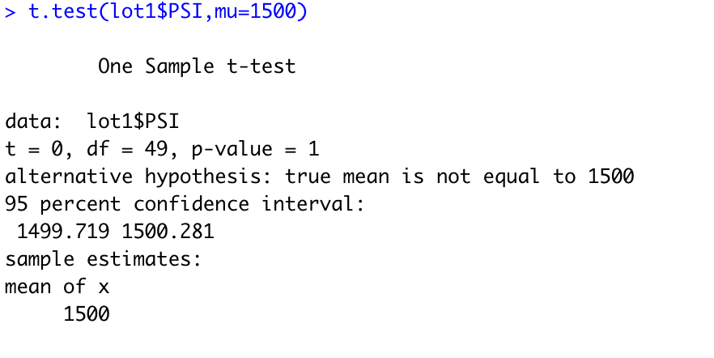
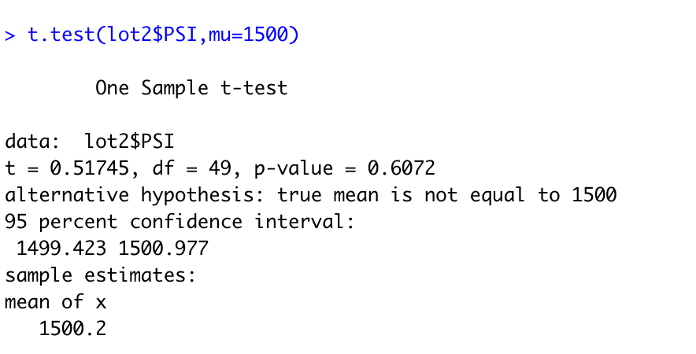
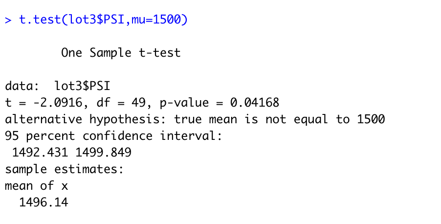

# MechaCar_Statistical_Analysis
## Linear Regression to Predict MPG
Statistical summary: 
### Which variables/coefficients provivded a non-random amount of variance to the mpg values in the dataset?
Variables that provide a non-random amount of variance to the mpg values in the data set are vehicle weight, length and and ground clearance. These values in the dataset could have a impact on the mpg of the MechaCar.
### Is the slope of teh linear model considered to be zero?
Since the p-value of the car model is 5.45 e-11, it is smaller than the significance value of .05. This idicates that the slope of the linear model is not zero.
### Does the linear model predict mpg of the MechaCar prototypes effectively?
The linear model does predict the mpg of the MechaCar protypes effectively. The reason being is that the r-squred value is 0.7149, meaning that roughly 71% of all predictions will be baesd off of the model.

## Summary Statistics on Suspension Coils
Total Summary: 
Lot Summary: 
### Design Specifications
The design specifications for the MechaCar suspension coils dictate that the variance of the suspension coils must not exceed 100 pounds per square inch. Does the current manufacturing data meet this design specification for all manufacturing lots in total and each lot individually?

 As can be observed within the total summary, the variance is 62.3, which is within the acceptable limits of the variance requirement.
 When looking at the lot summary, Lot 1 and 2 are also within the acceptable limits of the variance requirement, with lot 3 being the only exception, with a variance well over the 100PSI limit.

## T-Tests on Suspension Coils
### All Manufacturing Lots Summary
All Manufacturing Lots: 

Based off of the summary of all manufacturing lots, all three of the lots are stastistically similiar to the population mean of 1500. The mean of the samle is 1490.8, and has a p-value of .06, meaning there is not sufficient evidence to reject a null hypothesis.

### Lot 1 Summary
Lot 1:

Lot 1 has a sample mean of 1500, and a p-value of 1. This lot cannot reject the null hypothesis since there is no difference between the observed sample mean and the population mean of 1500.

### Lot 2 Summary
Lot 2:

Lot 2 is extremely similar to lot 1, with lot 1 having a sample mean of 1500 and lot 2 having a mean of 1500.2. The p-value for lot 2 is .61, which would lead to not rejecting the dull hypothesis.

### Lot 3 Summary
Lot 3:

Lot 3 was different then the other two lots. First in terms of its p-value, which was below .05, at .042, and a sample mean of 1496.1. The p-value is lower than the signifiance level of .05, leading to rejecting the null hyptohesis.
 
